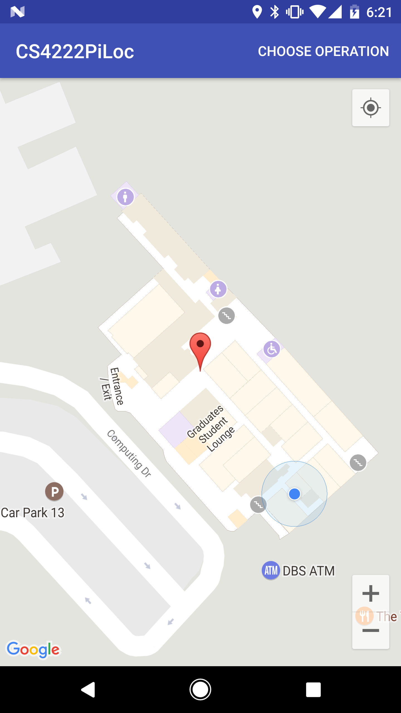

# Programming Assignment 3

## Group member:

- Liu Longyin "Eric" A0112725N
- Sharon Mariam Mathew A0113000N
- Nguyen Cao Nhat Linh A0112156U

## Task 1
Fingerprints are collected at 4 different locations at 10:57, 15:56 and 19:12.
A sorting script is written to sort the fingerprint results for easier comparison.
Some observations for the fingerprints are:

For location A:
- 60% of the fingerprints at 10:57 matches with the ones at 15:56
- 60% of the fingerprints at 15:56 matches with the ones at 19:12
- Around 40% of the fingerprints at 10:57 matches with the ones at 19:12

For other locations:
- 70-80% of the fingerprints at 10:57 matches with the ones at 15:56
- 70-80% of the fingerprints at 15:56 matches with the ones at 19:12
- 70-80% of the fingerprints at 10:57 matches with the ones at 19:12

Some conclusions:
- Fingerprints at different time of the day can be different since specific wifi router can be turned off (lab routers, etc.)
- Temporal-based variances can be an issue with location A, which is outside the air-conditioned area. For this location, the number of matches is the lowest.

## Task 2
- The location detected is shown in the file Task2_result.png included.

- Improved algorithm counts the number of matched fingerprints and at the same time adds up the RSSI difference and then choose the location with the most matched MAC address with smallest RSSI difference with some appropriate adjustment.

## Task 3
- Our group did West Coast Plaza, level 2, as requested in the forum.
- Estimated localization errors for this floor is around 2m for the whole area. The error is larger near the carpark entrances and mall entrance. The error is smaller near the middle corridors. More fingerprints collected can help reducing the errors
- The factors that affect localization can be
1. Different temperature interfering with WiFi signal (carpark entrances and mall entrances have heat blowing in from outside)
2. Fingerprints collected are not enough for localization
3. Fingerprints collected at different time of the day as when the localization is taken (we took fingerprints from evening until some of the shops are closed; localization is done when shops are closed, which might affect the results since shops may turned off their routers or the signal will be weaker)
- Improving localization accuracy can be made by having the radio map storing different value for the locations for different period of time in the day. That also means collecting more fingerprints is necessary.